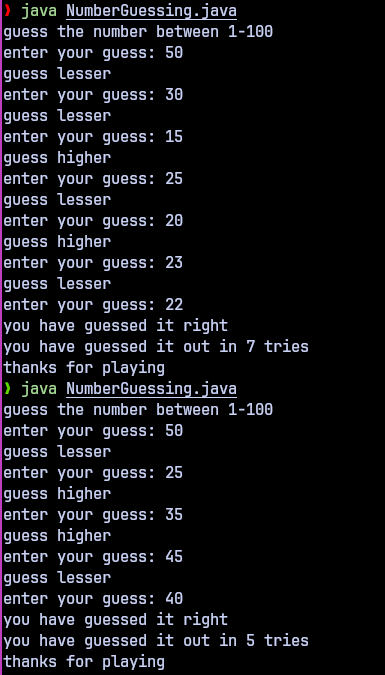

Java Number Guessing Game

#Description

Its a simple java Number Guessing Game written in java using while and for loop which runs untill the user provides the correct guess,
the program gives you hits like 'guess higher or guess lower' depends upon the guess the user provides.

#Features

-Generats a random number within range 1-100
-Accepts a input from the user as a guess and compares it with the random number generated
-if the number is greater that random number it tells the user to guess lesser and again asks for input and viceversa if its lesser
-loop goes untill user input is equals to random number generator

#Prerequisites

-Java Development Kit (JDK) 21.
-A terminal to run the program.

#Project Structure

-src/Calculator.java: Main Java file with calculator logic.
-Resource/:images of output
-README.md: Project documentation.

#Output

